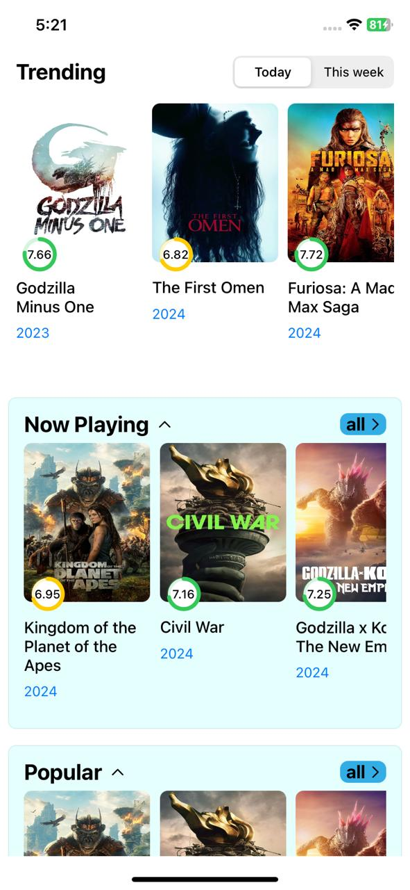
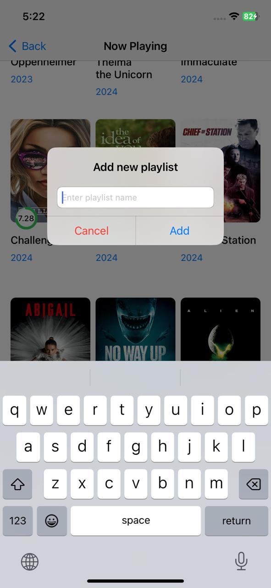

# Movies DB App

Movies DB App is an iOS app with the collection of movies from gatherd from [The Movie DB](https://www.themoviedb.org/)

It lists movies in the following categories
- Trending
  - Today
  - This Week
- Now Playing
- Popular
- Top Rated

### Snapshots

    

### Features
- Playlist management
- Pull to refresh
- Unit test cases

### Tools used
- XCode 15
- Swift
- Storyboards
